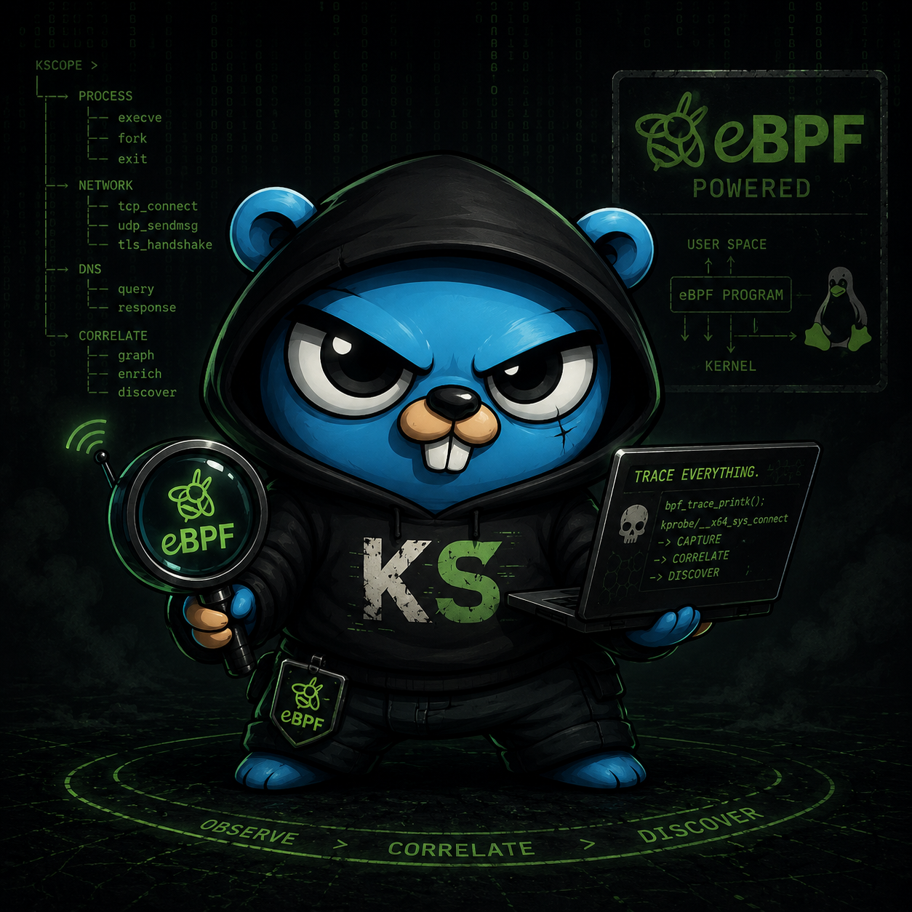

<p align="center">
    
</p>

<!--<div align="center">
  
</div>-->

KScope is an eBPF-based offensive discovery tool that observes real process and network behavior (DNS, IP, TCP) and correlates it in real time to reconstruct context and attack surface, in a passive and lightweight way.

### Why kscope?

KScope means kernel vision: a system-level observation and deep introspection tool to see what actually happens in processes and networking, focused on analysis and correlation.

### System requirements

- Linux with eBPF and cgroup v2
- clang and llvm
- libbpf and kernel headers
- bpftool
- Go and make

Install on Arch:

```sh
sudo pacman -S \
  base-devel \
  clang \
  llvm \
  libbpf \
  linux-headers \
  bpf
```

## Build

```sh
make tools
make btf
make build
make run
```

- `make btf` generates `internal/ebpf/vmlinux.h` using system BTF.
- The binary is created at `bin/kscope`.
- Running requires `sudo`.
- `make run` execute kscope in `observe` mode

## Quick usage

```sh
sudo ./bin/kscope -h

# observe command
sudo ./bin/kscope # observe by default
sudo ./bin/kscope observe

# proxy with redirection:
sudo ./bin/kscope proxy --cgroup /sys/fs/cgroup --config /dev/null --rule-ip 34.160.111.145:80
```

#### Observe arguments

```
- --output human|json (default: human). Output format. human prints readable lines, json prints one object per line.
- --modules dns,tcp,process,all (default: dns,tcp,process). Select capture and correlation modules.
- --bus-buffer (default: 4096). Event bus buffer size to absorb bursts.
- --subscriber-buffer (default: 1024). Correlation subscriber buffer; if full it may block or drop.
- --engine-buffer (default: 1024). Correlation engine output buffer.
- --drop-on-full (default: false). If true, drops events on saturation; if false, applies backpressure.
```

#### Proxy arguments

```
- --config path to yaml (default: configs/kscope-rules.yaml). Loads proxy rules and overrides from file.
- --cgroup cgroup v2 path (default: /sys/fs/cgroup). Cgroup where redirection hooks are attached.
- --proxy-listen-v4 (default: 127.0.0.1:18080). IPv4 address where the proxy listens.
- --proxy-redirect-v4 (default: 127.0.0.1:18080). Address the kernel rewrites IPv4 connect to.
- --proxy-listen-v6. IPv6 address where the proxy listens. If not set, IPv6 is not bound.
- --proxy-redirect-v6. Address the kernel rewrites IPv6 connect to. Used when listen_v6 is set.
- --rule-pid PID to redirect (repeatable). Redirects only connections from that process.
- --rule-comm process name to redirect (repeatable). Uses comm, limited to 16 bytes.
- --rule-ip ip or ip:port to redirect (repeatable). If no port is given, applies to any port.
- --rule-domain domain or domain:port to redirect (repeatable). Activated by DNS replies and TTL.
- --bus-buffer (default: 1024). DNS bus buffer for domain rules.
- --subscriber-buffer (default: 512). DNS subscriber buffer for domain rules.
- --drop-on-full (default: true). If true, drops DNS events on saturation.
```

Configuration precedence:
- yaml has priority over CLI
- if yaml does not exist, only CLI is used
- if yaml exist but you want to use CLI then you can execute with `--config /dev/null`

```sh
sudo ./bin/kscope proxy --config /dev/null --proxy-listen-v4 127.0.0.1:18080 --proxy-redirect-v4 127.0.0.1:18080
```

#### Configuration file

See [configs/kscope-rules.yaml](./configs/kscope-rules.yaml).

### Examples

```sh
# observe in JSON and only DNS
sudo ./bin/kscope observe --output json --modules dns

# proxy using config file
sudo ./bin/kscope proxy --config /configs/kscope-rules.yaml

# proxy with domain redirection
sudo ./bin/kscope proxy --cgroup /sys/fs/cgroup --config /dev/null --rule-domain ifconfig.me:80 --rule-domain ifconfig.me:443

# proxy using host IP when loopback does not work
sudo ./bin/kscope proxy --cgroup /sys/fs/cgroup --config /dev/null --proxy-listen-v4 0.0.0.0:18080 --proxy-redirect-v4 192.168.0.166:18080 --rule-ip 34.160.111.145:80
```

#### bpftool quick guide

```sh
# show cgroups with attached programs
sudo bpftool cgroup show /sys/fs/cgroup
sudo bpftool cgroup show /sys/fs/cgroup/user.slice/user-1000.slice/session-2.scope

# show relevant maps
sudo bpftool map show | grep proxy_target_v4
sudo bpftool map show | grep redirect_stats

# dump a map
sudo bpftool map dump id <ID>

# show proxy connections
ss -tnp | grep 18080
```
